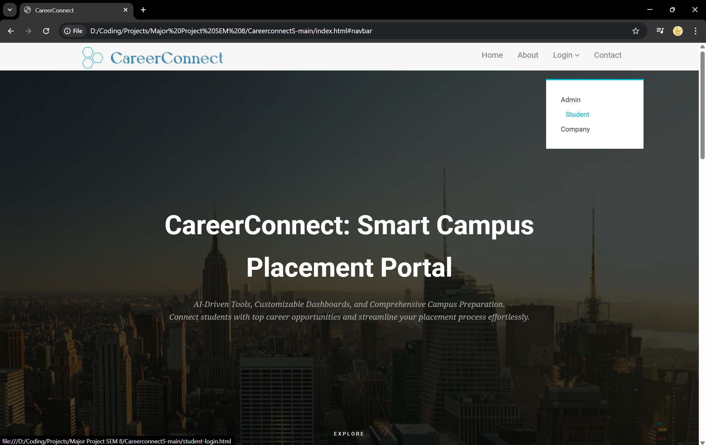
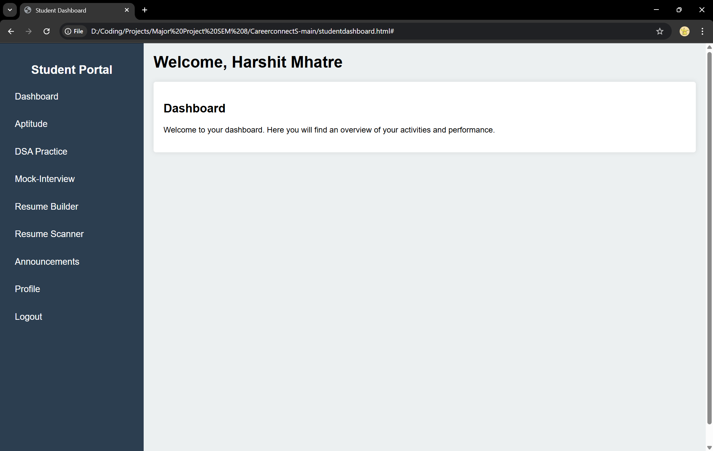
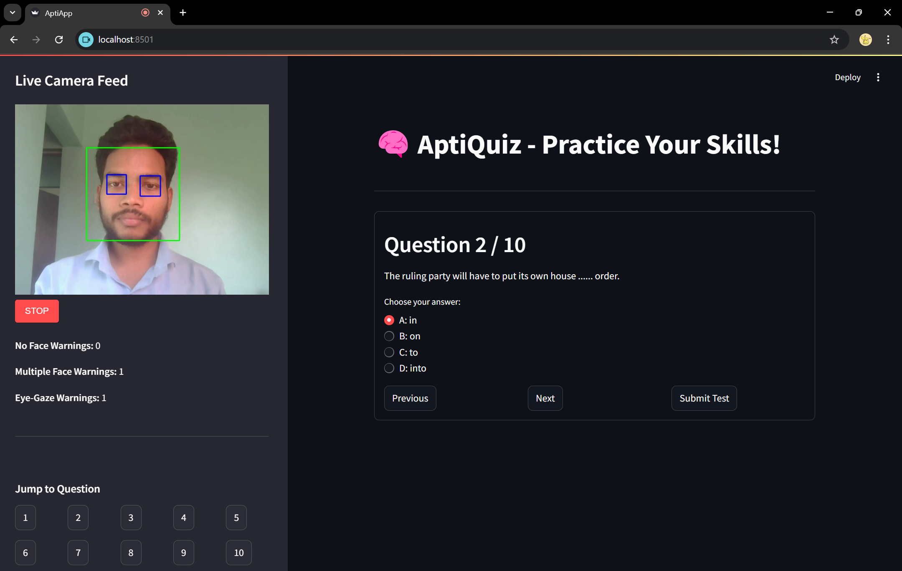
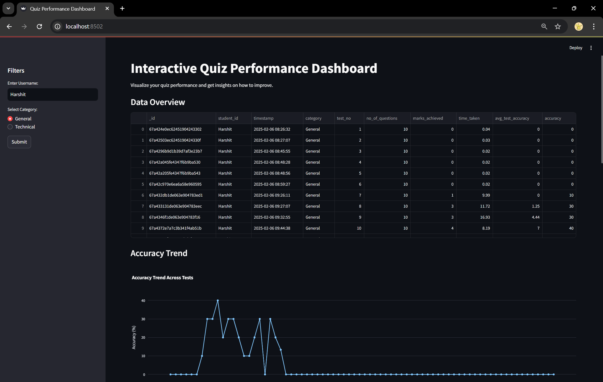
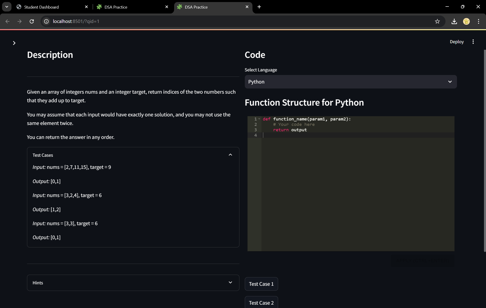
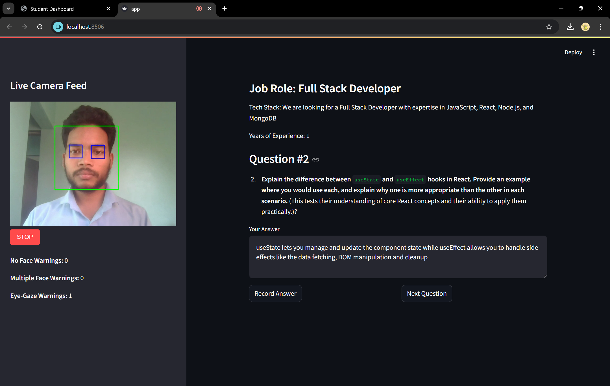
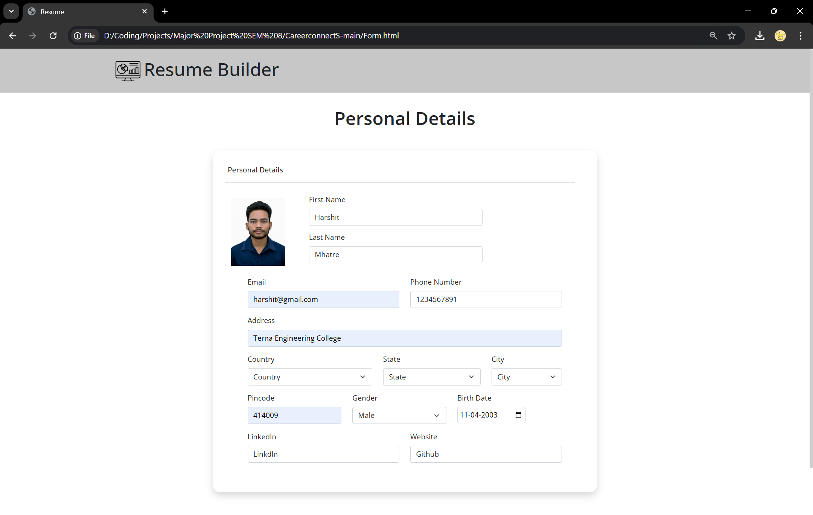
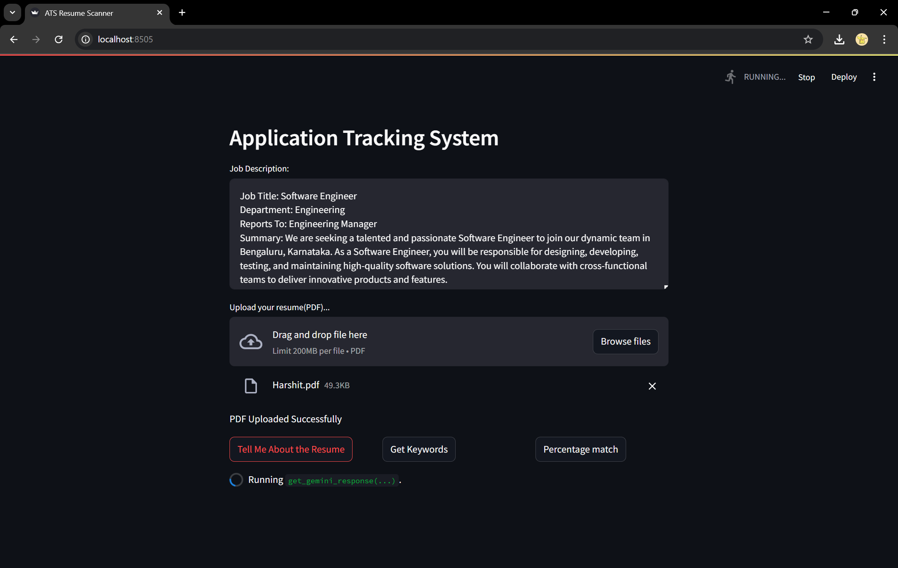
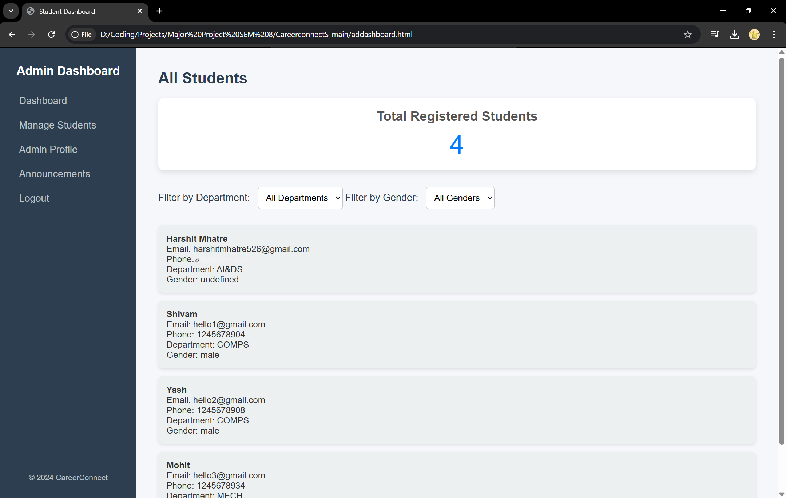

# 🎓 CareerConnect – Smart Campus Placement Portal

CareerConnect is an integrated **AI-powered platform** designed to streamline and elevate the campus placement experience for **students**, **training and placement officers (TPOs)**, and **recruiters**.

It features advanced modules for **resume building**, **aptitude & technical tests**, **AI-proctored interviews**, and **performance analytics**, making students industry-ready and boosting placement outcomes.

> ⚠️ Note: The repository structure may seem a bit disorganized, but running each component step-by-step as shown below will successfully launch the full project.

[](https://github.com/xHarshit/CareerConnect-Smart-Campus-Placement-Portal/blob/main/LICENSE)
[](https://github.com/xHarshit/CareerConnect-Smart-Campus-Placement-Portal/issues)
[](https://github.com/xHarshit/CareerConnect-Smart-Campus-Placement-Portal/stargazers)

---

## 🚀 Features

### 👨‍🎓 Student Portal

- **📊 Aptitude Test**  
  Timed logical reasoning tests with automatic scoring and face recognition-based proctoring.

- **📈 Aptitude Analysis Dashboard**  
  Topic-wise performance visualizations including accuracy, speed, and strength analysis.

- **💻 DSA Coding Test**  
  Real-time coding environment with question tracking and attempt logging.

- **📉 DSA Performance Dashboard**  
  Monitor scores, improvement history, and accuracy for each coding attempt.

- **🎙️ AI-Proctored Mock Interviews**  
  Real-time webcam-based interviews with attention tracking and expression monitoring.

- **🧾 Resume Builder**  
  Create and download structured, professional resumes.

- **📄 Resume ATS Scoring**  
  Get resume scores based on ATS keyword compatibility.

- **📢 Announcements**  
  View placement updates and notifications from TPOs.

- **🙍 Student Profile**  
  Manage academic/personal info and view individual test/interview performance.

---

### 🧑‍🏫 TPO & Company Dashboard

- 📊 Monitor student readiness with analytics  
- 📋 Post jobs, internships, or announcements  
- 📈 Export reports on aptitude, coding, and interview performance

---

## 🧠 Tech Stack

| Layer         | Technologies                                           |
|---------------|--------------------------------------------------------|
| **Frontend**  | HTML, CSS, Streamlit                                  |
| **Backend**   | Node.js, Python                                       |
| **ML/AI**     | OpenCV, TensorFlow, scikit-learn, face_recognition    |
| **Database**  | MongoDB                                               |


---

## 🛡️ AI Face Recognition Proctoring

- Real-time webcam face detection and tracking  
- Alerts for multiple faces or user looking away  
- Facial expression analysis during mock interviews  

---

## 🖼️ Screenshots

| Screenshot | Description                        |
|------------|------------------------------------|
|  | 1. Website Homepage                |
|  | 2. Student Dashboard               |
|  | 3. Aptitude Test with Face Recognition |
|  | 4. Aptitude Analysis               |
|  | 5. Technical Coding Test           |
|  | 6. Proctored Mock Interview     |
|  | 7. Resume Builder                  |
|  | 8. Resume ATS Result               |
|  | 9. Company / Admin Dashboard         |

---

## 🛠️ How to Run Locally

### Prerequisites

- [MongoDB](https://www.mongodb.com/try/download/community) installed and running  
- [Node.js](https://nodejs.org/en/download/) installed

---

## 🔐 API Configuration

To enable AI-powered features such as interview feedback and resume scoring using Gemini AI, you'll need to set up your Gemini API Key.

1. Get your Gemini API Key:
   - Visit: https://aistudio.google.com/app/apikey
   - Sign in with your Google account and generate a new API key.

2. Add the API key to the respective .env files:

📁 MockInter/.env
📁 ResumeATS/.env

GEMINI_API_KEY=your_api_key_here

⚠️ Make sure to replace your_api_key_here with your actual API key. Do not share this key publicly.

3. Restart the modules (MockInterview & ResumeATS) after setting the environment variables.

---

### Steps

1. **Clone the repository**

```bash
git clone https://github.com/your-username/CareerConnect.git
cd CareerConnect
```

2. **Start the Node.js server**

```bash
node server.js
```

3. **Run each Streamlit module in a new terminal:**

```bash
# Aptitude Test
cd Aptitude
streamlit run AptiApp.py

# Aptitude Dashboard
streamlit run InteractiveDashboard.py

# DSA Test
cd ../CodingPract
streamlit run DSA_app_db.py

# DSA Dashboard
streamlit run DSA_dash.py

# Mock Interview
cd ../MockInter
streamlit run app.py

# Resume Builder & ATS
cd ../ResumeATS
streamlit run app.py
```

4. **Launch the frontend**

Open `index.html` in a browser.

---

## 📈 Future Enhancements

- Add support for regional languages  
- Gamified tests with leaderboards  
- Real-time placement drive tracking  
- Admin dashboard with downloadable reports  
- SMS/Email notification integration  
- Mobile-friendly responsive design  

---

## 🪪 License

This project is licensed under the MIT License. See the [LICENSE](LICENSE) file for details.

